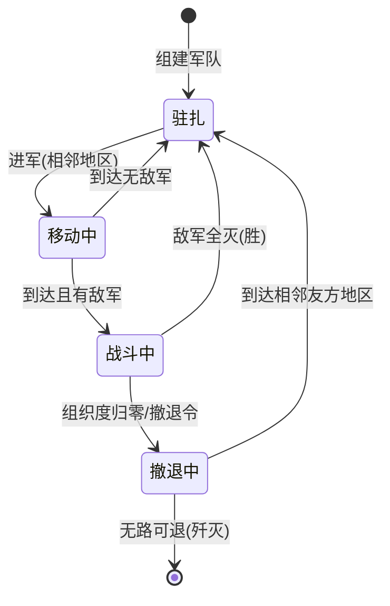

## 用户需求

为 koishi-plugin-textgame-war（Koishi 平台大型多人在线文本策略战争游戏）设计完整的军事系统。本任务的交付物是**一份设计文档**（提示词风格 Markdown），写入 `.github/prompts/军事系统.prompt.md`，供用户在新对话中直接引用以实现代码。本计划不写任何实际代码。

## 产品概述

军事系统是游戏的第三期核心玩法：玩家在联军（国家）中获授军衔后组建军队，从个人库存分配装备与人力武装军队，指挥军队在地区地图上驻扎、行军，与敌军触发回合制战斗，直至一方溃败或撤退。战斗机制大幅借鉴钢铁雄心4（软攻/硬攻/突破/防御/装甲/穿甲/组织度/HP/宽度），并适配异步文游（每 5 分钟后台结算一轮，战报推送群聊）。

## 核心功能

- **军衔体系**：5 级制（少尉/上尉/少校/上校/少将），决定建军资格、建军数量、兵力上限与命令优先级；双轨授衔（政治路走联军权限可授任意军衔，军事路将官仅可授/褫尉官）；政体联动（极权制元首自动最高军衔）；政变不重置军衔，被褫夺者军队转无主
- **军队组建**：全局自增纯数字编号 + 联军内番号；命名前缀固定为联军名，走现有名称审核工单流程
- **军队武装**：分配装备（扣个人库存）、发枪（快捷发步兵装备）、扩军（扣指挥官自己的工人）；士兵与装备通过"乘员数"咬合，人不够装备闲置
- **军队机动**：驻扎、进军（必须相邻地区，切比雪夫距离=1），路程用已有 haversine 距离计算，速度受 7 种陆地地形与 6 种地貌占比加权修正，到达后自动判定触发战斗
- **回合制战斗**：每 5 分钟一轮，含宽度匹配、超宽惩罚、破防判定、穿甲四档、装甲优势、组织度/HP 伤害、溃退/歼灭；每轮战报推送至联军首都群与战斗地区群
- **指挥链**：军队当前命令记录下达者军衔，高军衔命令覆盖低军衔（死守令可锁死撤退令）
- **扩展预留**：第一阶段纯陆军，注释预留空军支援、海军舰炮、地堡加成、弹药消耗挂载点

## 交付物

单一文件：`.github/prompts/军事系统.prompt.md`（与现有 `文游开发.prompt.md` 并列）。文档写成"提示词"风格——新对话的 AI 读完能直接开工：约定优先、公式伪代码化、数值表格化、标注所有可调参数。

## 已验证的代码事实（文档必须对齐）

- **分层架构**：`types ← models/utils ← logic ← services ← 指令集`；军事相关 models 目录（`src/models/军事相关/`）为空，属绿地
- **模型写法**：`ctx.model.extend("表名", {字段: {type:"unsigned", initial:0}}, {primary:"id", unique:[...]})`，参照 `src/models/玩家相关/玩家战争表.ts`
- **cron 写法**：`ctx.cron("*/5 * * * *", () => { 执行Xxx(ctx).catch(e => ctx.logger("xxx").error(e)) })`，参照 `src/services/重置调度/调度器.ts`（已有 5 分钟级 cron 先例）
- **装备清单**：`src/types/玩家相关/战争类型.ts` 共 27 种装备（陆军15：步兵装备/卡车/两栖坦克/轻型坦克/中型坦克/重型坦克/现代坦克/装甲运兵车/两栖装甲运兵车/坦克歼击车/自行防空车/野战炮/火炮/火箭炮/列车炮；空军8；弹药4）
- **地区数据**：`Region`（地区编号/栅格XY/地区地形 TerrainType 11种=4海7陆：平原/高原/浅丘/深丘/低山/中山/高山/控制国家）；`RegionTerra`（地貌占比：水域/雪地/草地/荒地/森林/城镇 + 地区崎岖度）
- **地理工具**：`src/地理集/距离计算.ts` 已有 `haversineDistance`/`计算真实距离`/`切比雪夫网格距离`（相邻判定=切比雪夫1）
- **政体**：`联军政体` 枚举=民主制/威权制/极权制（`src/types/联军相关/联军数据类型.ts`）
- **可复用入口**：`会话检查/玩家检查/玩家联军检查/获取联军权限等级/获取联军操作权限/地区解析/检查违禁词/创建改名审核工单/审核通过改名工单/确保服务记录/TRandom/更新玩家资料`

## 文档章节大纲（必须全部覆盖）

### 1. 数据模型（types + models 设计稿）

- **军队表**：autoInc 全局编号（主键）+ 联军内番号（联军内递增）+ 名称（联军名前缀）+ 所属联军UID + 指挥官UID + 士兵数量 + 经验值 + 状态机 + 所在地区 + 移动目标地区/到达时间戳 + 当前组织度/当前HP比例 + 当前命令及下达者军衔 + 27 种装备数量列（镜像玩家战争表风格）
- **战斗表**：战斗编号/地区编号/攻守双方联军UID/回合数/状态/参与军队列表
- **军衔表**：联军UID + 玩家UID + 军衔等级（唯一约束：联军内一人一衔）
- 状态机：驻扎 / 移动中 / 战斗中 / 撤退中，附转换图



### 2. 军衔体系

- 5 级权益表（建议默认值，标注可调）：少尉=1军/5千兵；上尉=1军/1万；少校=2军/2万；上校=3军/5万；少将=不限
- 双轨授衔规则：政治路（联军"授衔"操作权限项，任意军衔）+ 军事路（将官→仅尉官级）；褫夺同轨
- 政体联动表：极权制=元首自动少将；威权制=元首自动上校（建议）；民主制=元首无军衔（建议）；均标注可调
- 政变保留军衔、被褫夺转无主军队、政治权限重新任命指挥官的流程
- 命令优先级：新命令下达者军衔 ≥ 军队当前命令军衔才可覆盖

### 3. 装备属性表（核心数值框架，用户明确不会设计、必须给出）

- 27 种装备 × 属性列：软攻/硬攻/突破/防御/装甲/穿甲/组织度/HP/宽度/速度(km/h)/乘员数/硬度贡献/（油耗预留）
- 数值锚定钢4营级参数：步兵装备（宽2、软攻6-9、组织度60、防御18-22、突破2-3、速度4）；中型坦克（宽2、软攻22-40、突破30-55、装甲40-80、组织度10、速度8-12）；炮兵（宽3、软攻24-30、组织度0）；坦歼（硬攻40-80、穿甲60-130）；空军/弹药全部标注"第一阶段预留，不参与结算"

### 4. 军队属性聚合公式

- 有效装备数 = min(持有数, ⌊士兵数÷乘员数⌋)
- 加和：软攻/硬攻/突破/防御/HP/宽度 = Σ(装备属性×有效数) + 持枪步兵基础值 + 无枪士兵民兵值（极低）
- 组织度 = 各组成单位组织度算术平均；装甲/穿甲 = 40%×最高值 + 60%×加权平均
- 装甲率(硬度) = 装甲单位乘员占总兵力比例；速度 = 最慢单位速度

### 5. 移动系统

- 相邻校验（切比雪夫=1）；路程 = 计算真实距离(A,B)
- 修正速度 = 基础速度 × 地形修正(当前与目标地区取均值) × Σ(地貌占比×地貌速度修正)
- 到达时间戳落库；后台轮询到达 → 无敌军转驻扎，有敌军创建战斗

### 6. 战斗系统（每 5 分钟一轮，伪代码化完整流程）

入场宽度匹配（战场宽度=纯函数 f(地区地形, 地貌占比)，不落表，说明理由并给公式：基础宽度按地形档+地貌加权微调）→ 超宽惩罚 -(超出÷战场宽度)×100% 上限-33% → 攻击点数=round(有效攻击÷10) → 破防判定（未破防命中10%，破防超出部分40%）→ 穿甲四档（≥100%/75%/50%/&lt;50% → 100/80/65/50%）→ 装甲优势（组织度骰 1d4→1d6 仅软度部分）→ 组织度伤害=random(1~4)×0.053×修正、HP伤害=random(1~2)×0.06×修正（用 TRandom 或 Math.random，文档注明）→ HP 阶梯衰减（每掉10%输出降一档，战后HP损失70%转装备/人力实际损失）→ 溃退/歼灭判定 → 战报生成并推送双群（联军首都群 + 战斗地区群）→ 经验值累积

- 撤退指令流程、死守锁定（命令优先级）、组织度脱战恢复

### 7. 指令清单（每条注明权限校验路径）

组建军队/解散军队/军队命名(审核工单)/授衔/褫夺军衔/任命指挥官/分配装备/发枪/扩军/军队驻扎/进军/撤退/死守/查看军队/军队列表/查看战斗

### 8. 后台服务清单

战斗结算（`*/5 * * * *`）、移动到达轮询、组织度恢复；均走 `确保服务记录` + logger error 模式

### 9. 扩展预留

空军支援/海军舰炮/地堡加成/弹药消耗的注释挂载点说明

### 10. 落地检查清单

对齐 `文游开发.prompt.md`：types/models/barrel 导出/函数清单同步/复用优先

## 目录结构

```
.github/
└── prompts/
    ├── 文游开发.prompt.md      # [既有] 开发规范，保持不变
    └── 军事系统.prompt.md      # [NEW] 本次唯一交付物：军事系统完整设计文档（10 章节）
```

## 关键代码结构（文档中须精确给出的契约）

```typescript
// 军衔（5级制，数值即命令优先级权重）
enum 军衔 { 少尉 = 1, 上尉 = 2, 少校 = 3, 上校 = 4, 少将 = 5 }

// 军队状态机
enum 军队状态 { 驻扎 = "驻扎", 移动中 = "移动中", 战斗中 = "战斗中", 撤退中 = "撤退中" }

// 装备属性表行（静态配置，驻代码不落库）
interface 装备属性 {
    软攻: number; 硬攻: number; 突破: number; 防御: number;
    装甲: number; 穿甲: number; 组织度: number; HP: number;
    宽度: number; 速度: number; 乘员数: number; 硬度贡献: number;
}
```

## 实施注意

- 文档数值一律给出"建议默认值 + 可调标注"，方便用户后续平衡性调整
- 所有公式写伪代码而非真实代码，避免新对话实现时被带偏语言细节
- 不改动 `文游开发.prompt.md` 与任何 src 代码