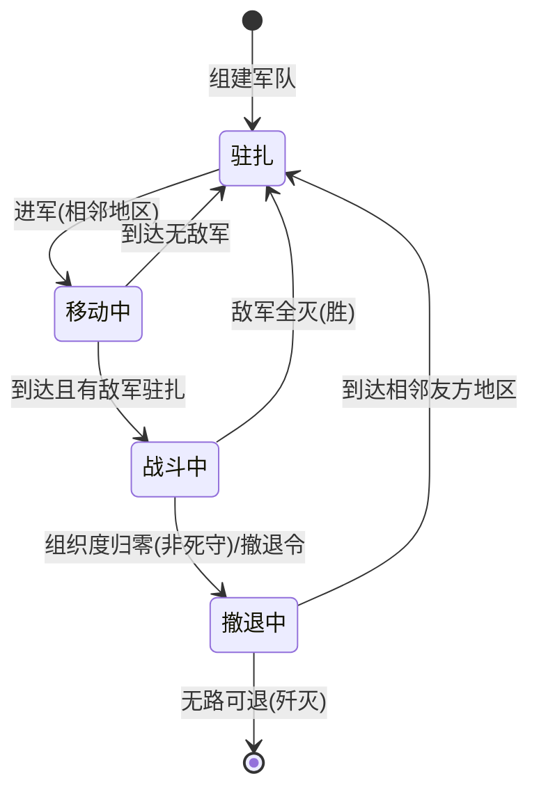

# 军事系统设计文档 (malie-textgame)

> **本文件是实现军事系统的唯一权威依据。实现时必须先读 `文游开发.prompt.md` 遵守分层规范，再按本文件落地。**
> 所有数值均为"建议默认值"，标注 `(可调)` 的参数应放入插件 Config 或文件顶部常量区，方便后续平衡性调整。

## 0. 系统总览

军事系统是游戏第三期核心玩法。闭环如下：

```
政治体系授衔 → 军官组建军队 → 个人库存分配装备/人力 → 驻扎/进军（相邻地区）
→ 遭遇敌军触发战斗 → 每 5 分钟后台结算一轮 → 一方溃败/撤退/歼灭 → 战报推送群聊
```

**第一阶段范围：纯陆军。** 空军、海军（舰炮支援）、弹药消耗、地堡加成全部只做数据与注释预留，不参与结算（挂载点见第 9 章）。

## 1. 数据模型（types + models 设计稿）

遵循项目规范：类型放 `src/types/军事相关/`，表声明放 `src/models/军事相关/`（该目录当前为空，纯绿地）。模型写法参照 `src/models/玩家相关/玩家战争表.ts`。

### 1.1 核心枚举

```typescript
// 军衔（5级制，数值即命令优先级权重，越大越高）
enum 军衔 {
    少尉 = 1,
    上尉 = 2,
    少校 = 3,
    上校 = 4,
    少将 = 5,
}

// 军队状态机
enum 军队状态 {
    驻扎 = "驻扎",
    移动中 = "移动中",
    战斗中 = "战斗中",
    撤退中 = "撤退中",
}

// 军队命令（当前指令，决定战斗中行为）
enum 军队命令 {
    正常 = "正常",      // 组织度归零自动撤退
    死守 = "死守",      // 组织度归零不撤退，战至歼灭
    撤退 = "撤退",      // 下一轮结算时执行撤退
}

// 战斗状态
enum 战斗状态 {
    进行中 = "进行中",
    已结束 = "已结束",
}
```

### 1.2 军衔表 `CoalitionRank`

| 字段 | 类型 | 说明 |
|------|------|------|
| id | autoInc | 主键 |
| 联军UID | string | |
| 玩家UID | string | |
| 军衔 | unsigned | 1~5，对应军衔枚举 |
| 来源 | string | `"政治授予"` / `"军事授予"` / `"政体自动"`，褫夺校验用 |
| 授予者UID | string | 授予人（政体自动时为元首UID） |
| 授予时间 | string | |

唯一约束：`["联军UID", "玩家UID"]`（联军内一人一衔）。

### 1.3 军队表 `Army`

| 字段 | 类型 | 说明 |
|------|------|------|
| id | autoInc | **全局编号**（主键，纯数字自增，指令指定用） |
| 番号 | unsigned | 联军内递增（显示用，如"第3集团军"），新建时取该联军 max(番号)+1 |
| 名称 | string | 完整名称 = `联军名 + 自定义部分`，强制前缀 |
| 名称是否审核 | boolean | 走现有改名审核工单 |
| 所属联军UID | string | |
| 指挥官UID | string \| null | `null` = 无主军队（原地驻扎，等待重新任命） |
| 士兵数量 | unsigned | |
| 经验值 | double | 战斗累积，影响伤害修正（见 6.8） |
| 状态 | string | 军队状态枚举 |
| 所在地区编号 | string | |
| 目标地区编号 | string \| null | 移动中/撤退中的目的地 |
| 预计到达时间 | string \| null | ISO 时间戳，后台轮询判定到达 |
| 当前组织度比例 | double | 0~1，初始 1；战斗中扣减，脱战恢复 |
| 当前HP比例 | double | 0~1，初始 1；阶梯衰减输出（见 6.6） |
| 当前命令 | string | 军队命令枚举 |
| 命令下达者军衔 | unsigned | **命令优先级核心**：新命令需 ≥ 此值才能覆盖 |
| 当前战斗编号 | unsigned \| null | 战斗中指向战斗表 id |
| 战斗阵营 | string \| null | `"进攻"` / `"防守"` |
| 27 种装备数量列 | unsigned × 27 | 镜像 `玩家战争表` 风格逐列声明（装备清单见第 3 章表头） |
| 建立日期 | string | |

### 1.4 战斗表 `Battle`

| 字段 | 类型 | 说明 |
|------|------|------|
| id | autoInc | 战斗编号 |
| 地区编号 | string | 战斗发生地 |
| 进攻方联军UID | string | 先进入敌区的军队所属联军 |
| 防守方联军UID | string | 地区控制方/驻扎方联军 |
| 回合数 | unsigned | 已结算轮数 |
| 状态 | string | 战斗状态枚举 |
| 开始时间 | string | |
| 结束时间 | string \| null | |
| 结果 | string \| null | `"进攻方胜"` / `"防守方胜"` / `"进攻方撤退"` 等 |

参与关系不落参与表：由 `Army.当前战斗编号 + Army.战斗阵营` 反查。

### 1.5 军队状态机



状态转换规则：
- `移动中` / `撤退中` 的军队不能下达进军以外的指令（不能分配装备/扩军——**战场上无法补给**，这是核心策略约束）
- `战斗中` 的军队只能下 `撤退` / `死守` / `正常` 命令
- 无主军队（指挥官UID=null）锁定为 `驻扎`，仅可被重新任命

## 2. 军衔体系

### 2.1 军衔权益表 `(可调)`

| 军衔 | 等级值 | 可建军数量 | 单军兵力上限 | 说明 |
|------|--------|-----------|-------------|------|
| 少尉 | 1 | 1 支 | 5,000 | 基层指挥官，建军最低门槛 |
| 上尉 | 2 | 1 支 | 10,000 | |
| 少校 | 3 | 2 支 | 20,000 | 战役指挥官 |
| 上校 | 4 | 3 支 | 50,000 | |
| 少将 | 5 | 不限 | 不限 | 战区统帅，可对**本国任何军队**下达命令 |

无军衔玩家**不能组建军队**（避免军阀化），只能从事经济生产。

### 2.2 双轨授衔（核心规则）

对应现实"初级军官任免权下放军级单位"：

| 路径 | 校验方式 | 可授/褫军衔 |
|------|---------|------------|
| **政治路** | 联军权限：新增操作权限项 `"授衔"`，走 `获取联军操作权限()` + `获取联军权限等级()` | 任意军衔（含少将） |
| **军事路** | 校验自身军衔 = 少将 | **仅尉官级**（少尉/上尉） |

- 校官及以上**只能**政治体系授予 —— 军官不能任命军官（中高级）
- 褫夺权与授予权同轨：将官只能褫尉官，政治路可褫任意军衔
- 授衔时写入 `来源` 字段；军事路授出的军衔，政治路可褫，反之亦可

### 2.3 政体联动 `(可调)`

| 政体 | 元首自动军衔 | 说明 |
|------|-------------|------|
| 极权制 | 少将 | 军政合一，最高统帅 |
| 威权制 | 上校（建议值） | 军政有限分离 |
| 民主制 | 无 | 军政分离，元首是文官 |

- 政体自动军衔的 `来源 = "政体自动"`；元首变更（政变/换届）时按新政体重算自动军衔
- 手动授予的军衔不受政体变更影响
- 实现挂载点：复用现有 `按政体动态分配权限()` / `政变后权限重置()` 的触发位置

### 2.4 政变与褫夺的处理

- **政变不重置军衔**：军官团是职业体系，不随政治清洗自动消失，新元首可事后逐个褫夺（制造"新政权 vs 旧军官团"张力）
- 被褫夺军衔的玩家：其指挥的所有军队 `指挥官UID = null`（无主军队，原地驻扎保留编制），由政治权限通过 `任命指挥官` 指令重新指派（被任命者需持有军衔且通过建军数量校验）

### 2.5 命令优先级（指挥链）

军队记录 `当前命令 + 命令下达者军衔`。新命令覆盖规则：

```
if 新命令下达者军衔 >= 军队.命令下达者军衔:
    覆盖（更新命令与军衔）
else:
    拒绝（提示"上级已下达XX命令"）
```

- 指挥官本人对自己的军队下达首个命令时无校验（初始军衔=0）
- 将官对本国任何军队有指挥权（见 2.1），其死守令可锁死尉官的撤退令
- 例外：无主军队任何人不可指挥，只能被任命

## 3. 装备属性表（数值框架）

**静态配置，驻代码不落库**（建议 `src/types/军事相关/装备属性表.ts`）。属性按**每件装备**给出，聚合时乘有效数量。

```typescript
interface 装备属性 {
    软攻: number;   // 对人员杀伤
    硬攻: number;   // 对装甲杀伤
    突破: number;   // 进攻时的防御力
    防御: number;   // 防守时的防御力
    装甲: number;   // 装甲厚度（非加和，聚合用40-60公式）
    穿甲: number;   // 穿甲厚度（同上）
    组织度: number; // 组织度贡献（加权平均用）
    HP: number;     // 血量贡献
    宽度: number;   // 战场宽度占用
    速度: number;   // km/h
    乘员数: number; // 操作该装备所需士兵
    硬度: number;   // 0~1，装甲率贡献（加权平均用）
}
```

### 3.1 陆军装备（15 种，第一阶段参与结算）`(数值可调)`

| 装备 | 软攻 | 硬攻 | 突破 | 防御 | 装甲 | 穿甲 | 组织度 | HP | 宽度 | 速度 | 乘员 | 硬度 |
|------|------|------|------|------|------|------|--------|-----|------|------|------|------|
| 步兵装备 | 0.007 | 0.001 | 0.003 | 0.020 | 0 | 0.001 | 60 | 0.25 | 0.002 | 4 | 1 | 0 |
| 卡车 | 0 | 0 | 0 | 0 | 0 | 0 | 0 | 0.5 | 0.001 | 12 | 0.2 | 0.1 |
| 两栖坦克 | 0.50 | 0.30 | 0.50 | 0.05 | 30 | 25 | 10 | 0.25 | 0.05 | 8 | 8 | 0.70 |
| 轻型坦克 | 0.40 | 0.25 | 0.50 | 0.05 | 20 | 20 | 10 | 0.20 | 0.04 | 12 | 8 | 0.80 |
| 中型坦克 | 0.60 | 0.50 | 0.80 | 0.08 | 60 | 55 | 10 | 0.20 | 0.04 | 10 | 10 | 0.85 |
| 重型坦克 | 0.70 | 0.80 | 1.00 | 0.10 | 95 | 80 | 10 | 0.20 | 0.04 | 6 | 12 | 0.95 |
| 现代坦克 | 1.00 | 1.00 | 1.30 | 0.15 | 110 | 95 | 10 | 0.25 | 0.04 | 12 | 10 | 0.90 |
| 装甲运兵车 | 0.05 | 0.02 | 0.10 | 0.15 | 10 | 5 | 0 | 0.30 | 0.03 | 9 | 2 | 0.50 |
| 两栖装甲运兵车 | 0.05 | 0.02 | 0.10 | 0.15 | 8 | 5 | 0 | 0.30 | 0.03 | 7 | 2 | 0.40 |
| 坦克歼击车 | 0.15 | 1.20 | 0.40 | 0.05 | 55 | 95 | 10 | 0.20 | 0.04 | 8 | 8 | 0.85 |
| 自行防空车 | 0.20 | 0.10 | 0.15 | 0.10 | 25 | 20 | 10 | 0.20 | 0.02 | 8 | 6 | 0.70 |
| 野战炮 | 0.50 | 0.03 | 0.08 | 0.12 | 0 | 0.01 | 0 | 0.015 | 0.06 | 4 | 12 | 0 |
| 火炮 | 0.70 | 0.05 | 0.10 | 0.15 | 0 | 0.01 | 0 | 0.017 | 0.083 | 4 | 14 | 0 |
| 火箭炮 | 1.00 | 0.08 | 0.15 | 0.10 | 0 | 0.01 | 0 | 0.020 | 0.083 | 8 | 10 | 0.10 |
| 列车炮 | 3.00 | 0.30 | 0.20 | 0.05 | 0 | 0.02 | 0 | 0.50 | 0.30 | 3 | 40 | 0 |

特殊规则：
- **两栖坦克 / 两栖装甲运兵车**：可进入水域占比 ≤ 50% 的地区（第一阶段不做登陆战，仅允许通过）
- **列车炮**：仅可沿有铁路的相邻地区移动（挂载铁路系统，无铁路不可进军）
- **卡车**：全员摩托化判定 —— `卡车数 ≥ 士兵数×0.05 (可调)` 时步兵不再拖速度（见 4.5）

### 3.2 空军（8 种）与弹药（4 种）—— 第一阶段预留

侦察机/战斗机/预警机/战术轰炸机/战略轰炸机/隐形轰炸机/大型运输机/小型运输机、火箭弹/防空弹药/轻型航弹/重型航弹：

- 表中只声明 `速度` 与 `乘员数` 占位（运输机可用于后续空投），其余属性留 0
- **不参与任何结算**，注释标注：`// TODO(第二阶段): 空军支援/弹药消耗挂载点，见第 9 章`
- 玩家仍可分配这些装备到军队（占库存转移），但属性计算时跳过

### 3.3 数值锚定说明（供平衡性调整参考）

数值按钢4营级参数折算（1 步兵营≈1000 人、1 坦克营≈50 辆、1 炮兵营≈36 门）：
- 5000 步兵 + 5000 步兵装备 ≈ 钢4 五营步兵师（宽 10、软攻 35、防御 100、组织度 60）
- 500 中型坦克 + 5000 乘员 ≈ 钢4 十营装甲师骨架（软攻 300、突破 400、装甲 60）
- 炮兵组织度为 0：混编时稀释全师组织度，逼玩家保持步炮比例

## 4. 军队属性聚合公式

输入：军队 27 种装备数量 + 士兵数量。输出：军队面板（软攻/硬攻/突破/防御/装甲/穿甲/组织度/HP/宽度/速度/硬度）。

**纯函数，建议落 `logic/军事相关/属性聚合.ts`，不落库，每次需要时现算。**

### 4.1 有效装备数（乘员咬合）

```
剩余士兵 = 士兵数量
for 装备 in 非步兵装备（按固定顺序）:
    有效数[装备] = min(持有数, floor(剩余士兵 / 乘员数))
    剩余士兵 -= 有效数[装备] × 乘员数
持枪步兵 = min(步兵装备数, 剩余士兵)
无枪士兵 = 剩余士兵 - 持枪步兵   // 民兵，属性极低
```

民兵面板 `(可调)`：软攻 0.001、硬攻 0、突破 0.001、防御 0.005、组织度 40、HP 0.2、宽度 0.002、速度 4、硬度 0。

### 4.2 加和属性

```
软攻 = Σ(装备.软攻 × 有效数) + 持枪步兵×0.007 + 无枪士兵×0.001
// 硬攻/突破/防御/HP/宽度 同理
```

### 4.3 平均属性

```
单位数[装备] = 有效数 × 乘员数 ÷ 500        // 折算"营"数（500人/营，可调）
组织度 = Σ(装备.组织度 × 单位数) ÷ Σ(单位数)   // 步兵按 持枪数÷500 计单位
硬度   = Σ(装备.硬度 × 乘员) ÷ 士兵数量        // = 装甲单位乘员占比
```

组织度底线提示（展示层用）：< 25 显示"一打就溃"警告。

### 4.4 装甲 / 穿甲（40-60 公式，防单件重坦 exploit）

```
装甲 = 0.4 × max(有效装备.装甲) + 0.6 × Σ(装备.装甲 × 乘员) ÷ Σ(乘员)
穿甲 = 0.4 × max(有效装备.穿甲) + 0.6 × Σ(装备.穿甲 × 乘员) ÷ Σ(乘员)
// 无装甲装备时 max 按 0 计
```

### 4.5 速度

```
基础速度 = min(所有有效装备.速度)            // 最慢单位拖全师（钢4规则）
if 卡车数 ≥ 士兵数 × 0.05:                   // 全员摩托化判定（可调）
    基础速度 = min(基础速度, 12) 中去掉步兵的 4  // 即步兵不再参与最慢判定
```

## 5. 移动系统

### 5.1 进军校验

1. 军队状态 = 驻扎
2. 目标地区与所在地区**相邻**：`切比雪夫网格距离(坐标A, 坐标B) === 1`（复用 `地理集/距离计算.ts`）
3. 目标地区非海洋地形（TerrainType 浅海/中海/深海/超深海 不可进入）
4. 目标地区水域占比 > 50% 时：要求两栖装备（两栖坦克+两栖装甲运兵车）乘员占比 ≥ 30% `(可调)` 才可进入
5. 携带列车炮时：目标路径需有铁路（挂载现有铁路数据）

### 5.2 行军时间

```
路程 = 计算真实距离(所在地区编号, 目标地区编号)          // haversine，复用现有
地形修正 = (地形速度修正[当前地区] + 地形速度修正[目标地区]) ÷ 2
地貌修正 = Σ(目标地区.地貌占比[k] × 地貌速度修正[k])       // 6种地貌加权
修正速度 = 基础速度 × 地形修正 × 地貌修正
游戏行军时长 = 路程 ÷ 修正速度                           // 游戏内小时
现实时长(分钟) = 游戏行军时长 × 60 ÷ 时间倍率              // 时间倍率默认 24（可调，现实1小时=游戏1天）
预计到达时间 = now + 现实时长
```

### 5.3 修正系数表 `(可调)`

地形速度修正（7 种陆地地形）：

| 地形 | 平原 | 高原 | 浅丘 | 深丘 | 低山 | 中山 | 高山 |
|------|------|------|------|------|------|------|------|
| 修正 | 1.0 | 0.9 | 0.85 | 0.7 | 0.6 | 0.45 | 0.3 |

地貌速度修正（6 种）：

| 地貌 | 水域 | 雪地 | 草地 | 荒地 | 森林 | 城镇 |
|------|------|------|------|------|------|------|
| 修正 | 0.5 | 0.6 | 1.0 | 0.9 | 0.75 | 1.1 |

### 5.4 到达处理（后台轮询）

每 5 分钟轮询 `预计到达时间 <= now` 的移动中军队：
- 目标地区无敌军 → 状态转 `驻扎`，清空目标与到达时间
- 目标地区有他国军队驻扎 → **创建战斗**（见第 6 章）：到达军队为进攻方，驻扎军队为防守方
- 撤退中军队到达友方地区 → 转 `驻扎`；组织度恢复速度翻倍 `(可调 ×2)`

## 6. 战斗系统（每 5 分钟一轮）

后台 cron `*/5 * * * *`（写法参照 `src/services/重置调度/调度器.ts`），对所有 `进行中` 战斗依次结算一轮。

### 6.1 战场宽度（纯函数，不落表）

宽度是地形与地貌的纯函数，无需存表（避免与地区数据不一致）：

```
基础宽度: 平原 80 / 高原 75 / 浅丘 70 / 深丘 60 / 低山 55 / 中山 45 / 高山 35   (可调)
战场宽度 = 基础宽度 × (1 + 0.3×城镇占比 - 0.2×森林占比 - 0.3×水域占比)
clamp(战场宽度, 30, 120)
```

### 6.2 单轮结算流程（伪代码）

```
for 战斗 in 所有进行中战斗:
    战斗.回合数 += 1
    攻方 = 战斗中阵营=进攻的军队; 守方 = 阵营=防守的军队
    if 攻方为空 or 守方为空: 结束战斗(另一方胜); continue

    W = 战场宽度(战斗.地区)
    攻方上场 = 按宽度入场(攻方, W)   // 按军队列表顺序入场，宽度满则后续排队预备队
    守方上场 = 按宽度入场(守方, W)
    攻方超宽惩罚 = max(-0.33, -(Σ攻方上场宽度 - W) ÷ W)   // 未超宽为 0
    守方超宽惩罚 = 同理

    // ---- 攻方输出 ----
    for A in 攻方上场:
        目标硬度 = 守方上场加权平均硬度
        A有效软攻 = A.软攻 × (1 - 目标硬度) × 地形地貌攻击修正 × (1 + 攻方超宽惩罚) × HP衰减(A)
        A有效硬攻 = A.硬攻 × 目标硬度 × 同上修正
        A攻击点数 = round((A有效软攻 + A有效硬攻) ÷ 10)
        // 守方防御按各军队宽度占比分摊承受，A 随机选取一支守方军队为主目标
        执行交火(A, 主目标, A攻击点数, 守方防御点数)

    // ---- 守方反击（用防御 vs 攻方突破）----
    for D in 守方上场: 同理反向结算

    // ---- 溃退判定 ----
    for 军队 in 双方上场:
        if 军队.当前组织度比例 ≤ 0:
            if 军队.当前命令 == 死守: 继续战斗（组织度锁 0，每轮额外吃 HP 伤害 ×1.5 (可调)）
            else: 尝试撤退（见 6.7）
    if 一方全灭或全部撤退: 结束战斗，写结果
    生成战报并推送（见 6.9）
```

### 6.3 交火（破防机制）

```
攻击点数 vs 防御点数（防守方用防御，进攻方用突破，不互通）:
    被格挡部分 = min(攻击点数, 防御点数)，命中率 30%
    破防部分   = max(0, 攻击点数 - 防御点数)，命中率 40%
期望命中次数 = 被格挡部分 × 0.30 + 破防部分 × 0.40
```

### 6.4 穿甲判定（四档）

```
穿甲比 = 攻击方.穿甲 ÷ 目标.装甲    // 目标装甲为 0 时视为 100%
穿甲比 ≥ 100% → 伤害系数 1.00
75% ~ 99%     → 0.80
50% ~ 74%     → 0.65
< 50%         → 0.50
```

装甲优势：攻击方为装甲单位（硬度 ≥ 0.5 `(可调)`）且穿甲比 < 100% 的**反向**（目标穿不动我）时，攻击方组织度伤害骰子 1d4 → 1d6（期望 +40%），仅作用于目标软度部分的伤害。

### 6.5 伤害公式

```
每次命中:
    组织度伤害 = random(1~4 或装甲优势 1~6) × 0.2 × 穿甲伤害系数
    HP伤害     = random(1~2) × 3.5 × 穿甲伤害系数

（地形地貌修正已在 6.2 有效软攻/硬攻阶段计入，此处不再重复相乘，否则进攻方地形惩罚会被平方）
目标.当前组织度比例 -= 组织度伤害 ÷ 目标.组织度上限
目标.当前HP比例     -= HP伤害 ÷ 目标.HP上限
```

随机数用 `Math.random` 即可（或复用 `TRandom()` 三角分布使伤害更集中，**建议 TRandom**，注释标注可调）。

### 6.6 HP 阶梯衰减与实际损失

```
HP衰减档位 = floor(当前HP比例 × 10) ÷ 10    // 每掉 10% 一档
HP衰减(军队) = HP衰减档位                     // 输出乘该系数（90~99% → ×0.9）
```

战斗结束（或每轮结束）结算实际损失：`本轮HP损失 × 70% (可调)` 转为装备与士兵的永久损失，按装备价值占比随机分配扣减；士兵损失同步扣减。装备损失不返还任何人库存（战损消耗）。

### 6.7 撤退

- 主动撤退：`撤退` 命令的军队在下一轮结算后脱离战斗，状态转 `撤退中`，目的地 = 相邻友方地区（优先本国控制，其次允许驻扎的友军地区；随机/按距离选）
- 被动溃退：组织度 ≤ 0 且非死守，强制同上撤退
- **无路可退**（四邻皆敌/海洋）：军队歼灭，装备与士兵全损，战斗表记录
- 撤退中到达后转 `驻扎`

### 6.8 经验值

```
每轮参战: 经验值 += 造成组织度伤害 × 0.01 (可调)
经验修正 = 1 + min(0.5, 经验值 ÷ 1000)      // 上限 +50% 伤害（可调）
```

### 6.9 战报推送

每轮结算后生成战报，推送到**两个群聊**：
1. 战斗发生地区绑定的群聊（每轮简报：回合数、双方组织度/HP 概况、战损）
2. 双方联军首都绑定的群聊（大战报：参战军队番号、指挥官、回合摘要、溃退/歼灭事件）

战报模板要点：隐藏精确数值，用模糊分级（"轻微损伤/受创/重创/濒临崩溃"），给观众想象空间 `(可调：是否显示精确数值做成配置项)`。

## 7. 指令清单

| 指令 | 参数 | 权限校验 | 效果 |
|------|------|---------|------|
| 组建军队 | [名称] | 持有军衔 ≥ 少尉；建军数量未达上限 | 创建军队（id 自增、番号=联军内 max+1、默认名称 `联军名+第N军`），名称走审核工单 |
| 解散军队 | <军队编号> | 指挥官本人 或 联军政治权限 | 装备返还指挥官库存，士兵返还指挥官工人，删表 |
| 军队命名 | <军队编号> <新名称> | 指挥官本人 | 强制联军名前缀，`检查违禁词()` + `创建改名审核工单()` |
| 授衔 | <玩家> <军衔> | 双轨：政治路 `获取联军操作权限("授衔")` 任意军衔；军事路 自身少将→仅尉官 | 写军衔表 |
| 褫夺军衔 | <玩家> | 同授衔双轨 | 删军衔，其军队转无主 |
| 任命指挥官 | <军队编号> <玩家> | 联军政治权限；被任命者有军衔且建军数未超限 | 无主军队重新归属 |
| 分配装备 | <军队编号> <装备名> <数量> | 指挥官本人（将官不可越权动别人军队的装备） | 正数=扣个人库存给军队；负数=军队返还库存 |
| 发枪 | <军队编号> <数量> | 同上 | 等价于 `分配装备 <编号> 步兵装备 <数量>` 的快捷指令 |
| 扩军 | <军队编号> <人力> | 指挥官本人；单军兵力上限校验 | 扣指挥官自己的工人，别名"分配人力" |
| 裁军 | <军队编号> <人力> | 指挥官本人 | 士兵返还指挥官工人 |
| 进军 | <军队编号> <地区编号> | 指挥官本人 或 军衔 ≥ 军队.命令下达者军衔 的本国将官 | 相邻校验 → 移动中（见第 5 章） |
| 撤退 | <军队编号> | 同上命令优先级校验 | 当前命令=撤退，下轮结算执行 |
| 死守 | <军队编号> | 同上 | 当前命令=死守 |
| 取消死守 | <军队编号> | 军衔 ≥ 死守令下达者军衔 | 当前命令=正常 |
| 查看军队 | <军队编号> | 本国军队任意成员可查；他国军队需 `地区查询权限检查()` 类校验 | 展示面板（第 4 章聚合结果） |
| 军队列表 | [联军] | 联军成员 | 列出本国军队番号/指挥官/状态 |
| 查看战斗 | <地区编号> | 地区查询权限 | 展示进行中战斗概况 |
| 我的军衔 | | 联军成员 | 展示军衔与权益 |

指令编排规范：只做参数接收 + 调用 utils/logic 入口 + 文本组装（见 `文游开发.prompt.md`）。

## 8. 后台服务清单

| 服务 | cron | 职责 |
|------|------|------|
| 战斗结算服务 | `*/5 * * * *` | 第 6 章单轮结算全流程 |
| 移动到达服务 | `*/5 * * * *`（可与战斗结算同服务内先后执行） | 5.4 到达轮询、触发战斗创建 |
| 组织度恢复服务 | 并入战斗结算 | 脱战军队每轮 `组织度比例 += 0.05 (可调)`，上限 1 |

写法：`ctx.cron(...)` + `确保服务记录()` + `.catch(e => ctx.logger("xxx").error(e))`，参照 `src/services/重置调度/调度器.ts`。

## 9. 扩展预留（第一阶段不实现，仅注释挂载）

| 扩展点 | 挂载位置 | 说明 |
|--------|---------|------|
| 空军支援 | 6.2 攻方输出前 | `// TODO(第二阶段): 有制空权方攻击修正 +X%，侦察机提供情报` |
| 弹药消耗 | 6.5 伤害计算处 | `// TODO(第二阶段): 火箭炮/航弹类装备无弹药时软攻归零` |
| 海军舰炮支援 | 6.2 沿海战斗判定 | `// TODO(第三阶段): 沿海地区战斗可受舰炮加成` |
| 地堡加成 | 6.3 防御点数处 | `// TODO(第二阶段): 防守方地堡提供防御加成与减伤` |
| 防空 | 自行防空车属性 | `// TODO(第二阶段): 对空攻击属性，反制空军支援` |
| 登陆战 | 5.1 水域校验处 | `// TODO(第三阶段): 两栖装备主导的跨海进军` |

## 10. 落地检查清单

实现完成后逐项核对（对齐 `文游开发.prompt.md` 修改检查清单）：

- [ ] `types/军事相关/`：军衔/军队状态/命令/战斗状态枚举 + 装备属性表 + 军队面板类型
- [ ] `models/军事相关/`：军衔表/军队表/战斗表，barrel 导出同步 `index.ts`
- [ ] `logic/军事相关/`：属性聚合、行军时间计算、战场宽度、战斗结算核心（纯函数优先）
- [ ] `utils/`：新增可复用入口（军队解析、军衔检查、指挥权限检查）→ **同步更新 `文游开发.prompt.md` 函数清单**
- [ ] `services/`：战斗结算/移动到达/组织度恢复
- [ ] `指令集/军事/`：第 7 章全部指令
- [ ] 联军权限配置：新增 `"授衔"` 操作权限项，政体默认权限表同步
- [ ] 名称审核：组建军队/军队命名接入现有工单流程
- [ ] 配置项：所有 `(可调)` 参数归入插件 Config 或常量区

---

**最重要的三条：**
- **属性一律现算不落库**（装备数量落库，面板纯函数聚合），避免双写不一致。
- **命令优先级只比军衔数值**，高军衔一句话压死低军衔。
- **所有伤害公式照抄第 6 章伪代码**，数值先用建议默认值，平衡性后续调。
